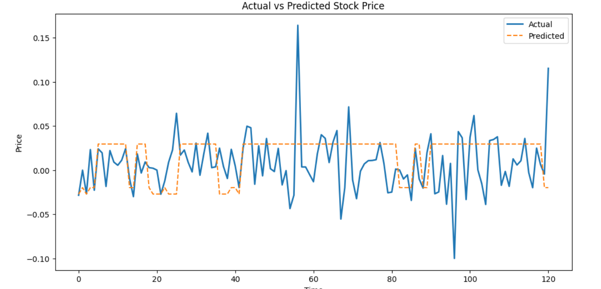
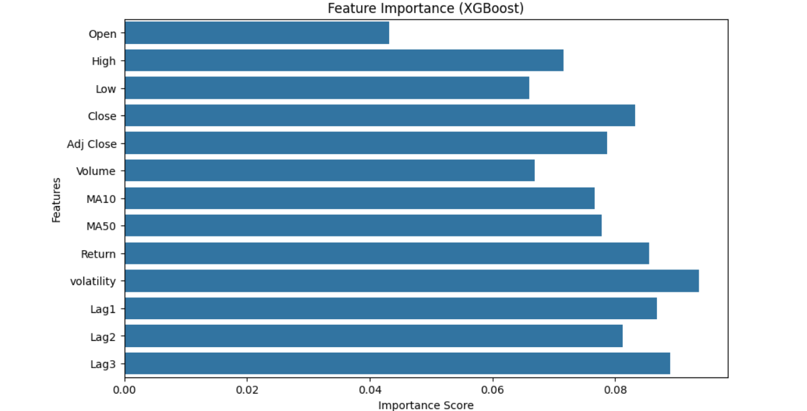
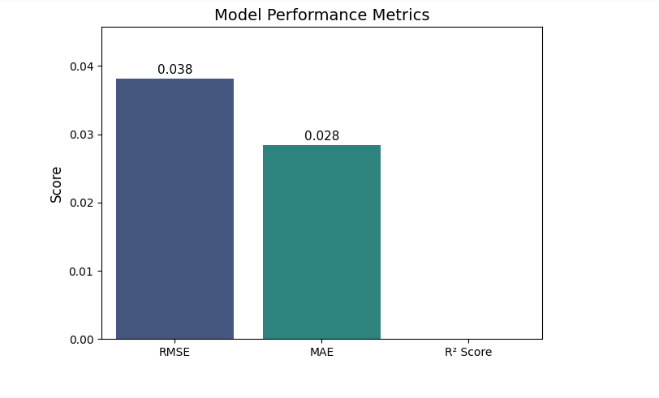
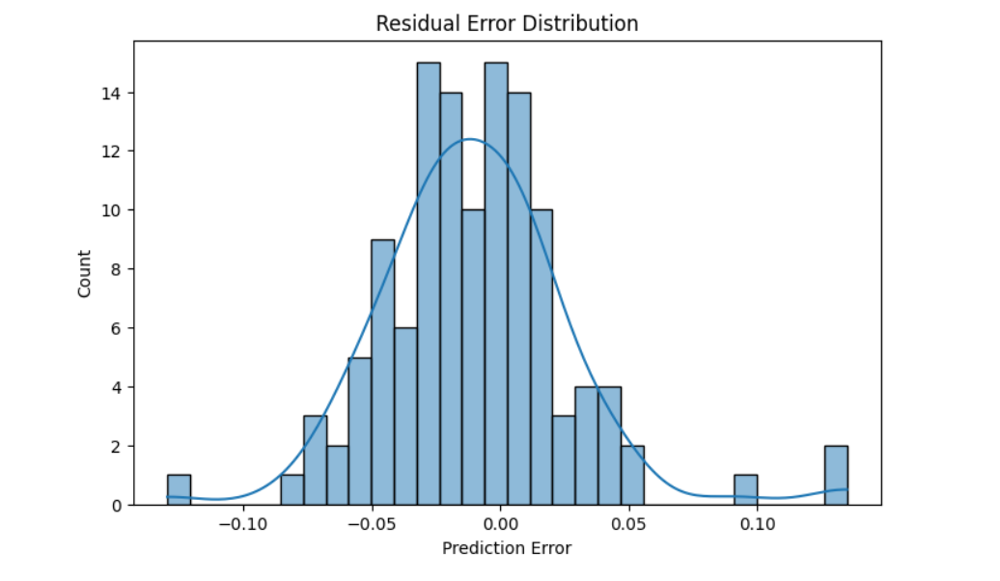

# 📈 Stock Price Prediction using XGBoost

---

## Table of Contents

- [About The Project](#about-the-project)
- [Project Structure](#project-structure)
- [Built With](#built-with)
- [Getting Started](#getting-started)
  - [Dependencies](#dependencies)
  - [Installation](#installation)
  - [Alternative: Export Your Environment](#alternative-export-your-environment)
- [Usage](#usage)
- [Project Workflow](#project-workflow)
- [Results](#results)
- [Roadmap](#roadmap)
- [Contributing](#contributing)
- [License](#license)
- [Authors](#authors)
- [Acknowledgements](#acknowledgements)


## About The Project

This project implements a Machine Learning-based **Stock Price Prediction System** using historical stock market data.

The main objective is to predict future stock prices using advanced regression techniques while following a complete and professional machine learning pipeline.

The project includes:

- Data preprocessing using **Pandas**
- Feature scaling using **MinMaxScaler**
- Model training using **XGBoost Regressor**
- Model testing and performance evaluation
- Data visualization using **Matplotlib and Seaborn**

The dataset consists of historical stock information such as Open, High, Low, Close, Volume, and engineered features. The target variable represents the future stock price.

This project demonstrates a complete end-to-end machine learning workflow suitable for academic and practical applications.

## Project Structure
``` bash
STOCK_PRICE_PREDICTION/
├── app/                        # Streamlit web application
├── data/
│   ├── nvidia.csv              # Raw dataset
│   └── processed_nvidia.csv    # Cleaned & processed data
├── docs/
│   └── README.md
├── models/
│   └── trained_model.pkl       # Serialized trained model
├── notebooks/
│   ├── evaluate.ipynb
│   ├── model_testing.ipynb
│   ├── model_training.ipynb
│   ├── Model_Visualization.ipynb
│   ├── preprocessing.ipynb
│   ├── scaler.pkl
│   └── xgboost_model.pkl
├── src/
│   ├── evaluate.py
│   ├── features.py
│   ├── predict.py
│   ├── preprocess.py
│   ├── test.py
│   ├── train.py
│   ├── utils.py
│   └── visual.py
├── .gitignore
├── LICENSE
├── requirements.txt
└── README.md
```
## Built With

- Python 3.10+
- Pandas
- NumPy
- Scikit-learn
- XGBoost
- Matplotlib
- Seaborn
- Pickle

## Getting Started

To run this project locally, follow the instructions below.


## Dependencies

Required libraries:

- pandas >= 1.5.0
- numpy >= 1.23.0
- scikit-learn >= 1.2.0
- xgboost >= 1.7.0
- matplotlib >= 3.6.0
- seaborn >= 0.12.0

Install all dependencies using:
```bash
pip install -r requirements.txt
pip install pandas numpy scikit-learn xgboost matplotlib seaborn
```

## Installation

Clone the repository:
```bash
git clone https://github.com/ayesha-aniqa/Stock_price_prediction
cd Stock_price_prediction
python -m venv .venv
source .venv/bin/activate  # Windows: .venv\Scripts\activate
pip install -r requirements.txt
```
Navigate to the project folder:


## Usage

The project is organized into Jupyter notebooks representing each stage of the machine learning pipeline.

### 1. Dataset
kaggle Dataset link: https://www.kaggle.com/datasets/amirhoseinmousavian/nvidia-corporation-nvda-stock-price

## Description
This dataset is a time-series stock market dataset that contains daily trading information for a financial asset from 2020 to 2024. Each row represents a single trading day and includes key features such as the opening price, highest and lowest prices during the day, closing price, adjusted closing price (which accounts for dividends and stock splits), and trading volume. This type of dataset is commonly used for analyzing market trends, studying price movements, and building predictive models in finance.

Each row represents one trading day, with the following columns:

Date – the trading day

Open – the price at which the asset opened

High – the highest price reached during the day

Low – the lowest price during the day

Close – the price at market close

Adj Close – the adjusted closing price (accounts for dividends, splits, etc.)

Volume – the number of shares traded that day
Overall, the dataset is useful for financial analysis, such as tracking price trends, performing technical analysis, building predictive models, or studying market behavior over time.

### 2. Data Preprocessing

Run: 
```bash
notebooks/preprocessing.ipynb
```

This notebook:
- Cleans missing values
- Creates the target variable
- Splits dataset into training and testing sets (90% train, 10% test)
- Applies MinMax scaling

### 3. Model Training

Run: 
```bash
notebooks/model_training.ipynb
```

This notebook:
- Trains an XGBoost Regressor
- Uses hyperparameters:
  - n_estimators = 500
  - learning_rate = 0.03
  - max_depth = 6
  - random_state = 42
- Saves trained model as:
  - xGboost_model.pkl
  - scaler.pkl

### 4. Model Testing

Run: notebooks/model_testing.ipynb


This notebook:
- Loads saved model and scaler
- Predicts stock prices
- Evaluates performance using:
  - Mean Squared Error (MSE)
  - Mean Absolute Error (MAE)
  - R² Score

### 5. Model Visualization

Run: notebooks/Model_Visualization.ipynb


This notebook generates:

- Actual vs Predicted Stock Price Plot
- Feature Importance Graph
- Residual Error Distribution
- Scatter Plot (Predicted vs Actual)
- Model Performance Summary

### Visuals
 
 
 
 


## Project Workflow

Raw Stock Data
↓
Data Preprocessing (Pandas)
↓
Feature Scaling (MinMaxScaler)
↓
Train-Test Split (Time-Series Based)
↓
Model Training (XGBoost)
↓
Model Evaluation
↓
Visualization (Matplotlib & Seaborn)


This structured workflow ensures reproducibility, clarity, and professional implementation standards.

---

## Results

The model performance is evaluated using:

- Mean Squared Error (MSE)
- Mean Absolute Error (MAE)
- R² Score

The XGBoost model demonstrates strong predictive capability in modeling nonlinear patterns in stock price data.

Visual comparisons between actual and predicted values show close alignment, validating model effectiveness.

## Roadmap

Future improvements:

- Hyperparameter tuning using GridSearchCV
- Time-series cross-validation
- Real-time stock API integration
- Deployment using Flask or Streamlit
- Comparison with Deep Learning models (LSTM/GRU)

## Contributing

Contributions are welcome.

Steps:

1. Fork the repository
2. Create a feature branch:
3. Commit changes:
4. Push to branch:
5. Open a Pull Request

## License

Distributed under the MIT License.  
See LICENSE file for more information.

---

## Team Contribuition

## 👥 Team
| Member | Role | Contribution |
|--------|------|-------------|
| [Ayesha Aniqa](https://github.com/ayesha-aniqa) | Team Lead | Team leadership, website frontend, model evaluation, performance analysis, collaboration & coordination |
| [Anees Ahmad](https://github.com/IaM-AnEeS) | ML Engineer | Dataset preprocessing, data cleaning, feature engineering, model training & development, README contribution |
| [Kashan Saqib](https://github.com/Kashhan) | QA Engineer | Model testing, error analysis, validation & performance testing |
| [Muhammad Mahaz Noor](https://github.com/mahaznoor) | Technical Writer | Documentation, README preparation, technical writing, content structuring |
| [Hizar Abdullah](https://github.com/khizerista) | Data Analyst | Model visualization, data visualization, result visualization, graphical representation |


## Acknowledgements

- Scikit-learn Documentation
- XGBoost Official Documentation
- Kaggle (Dataset Source)
- Open Source Community


If you found this project useful, consider giving it a star.
Thank You
  
