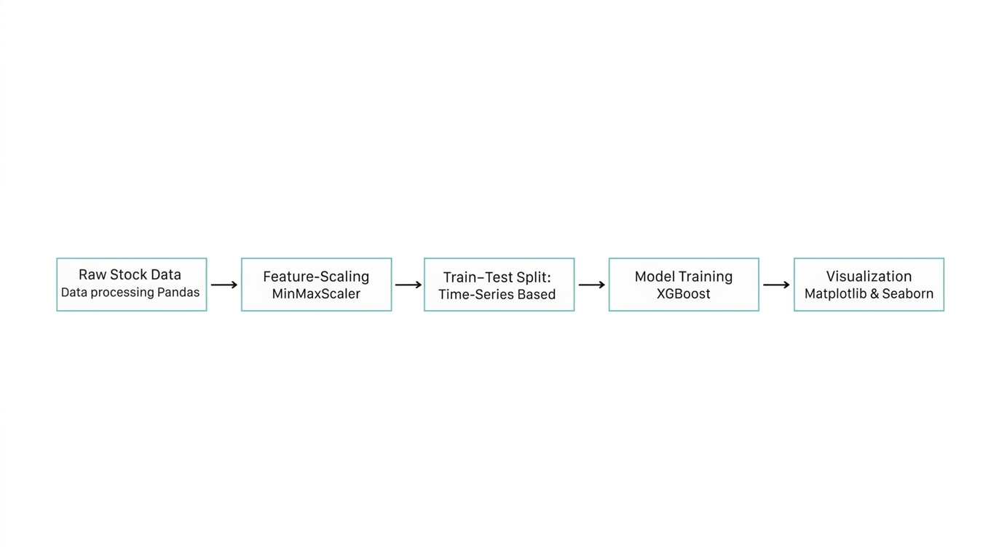
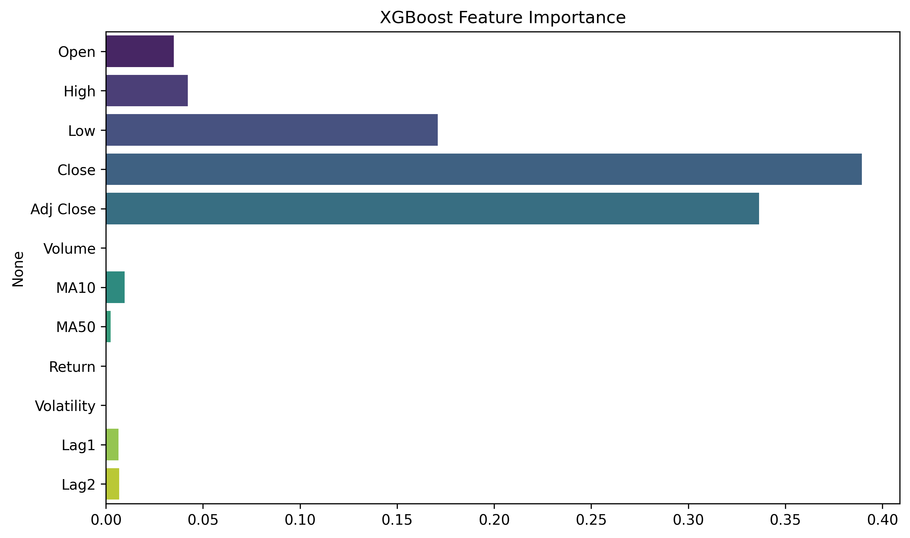
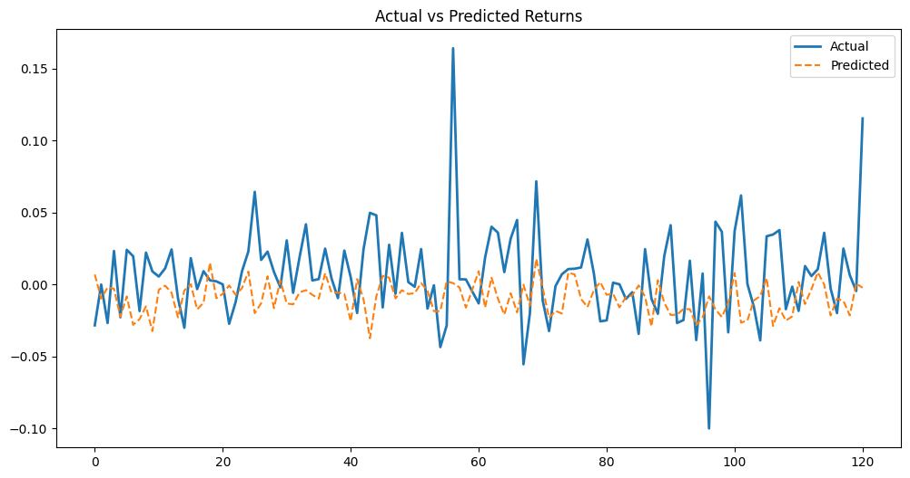
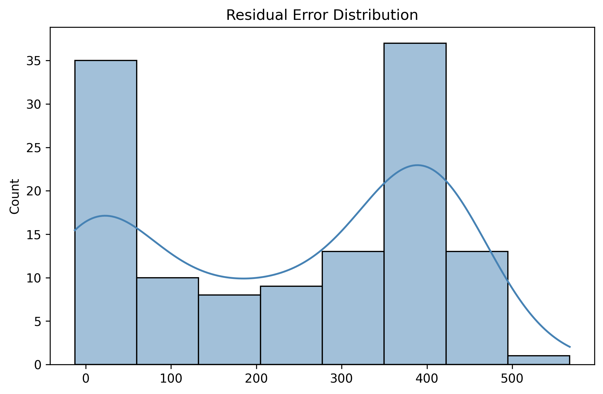

# 📈 NVIDIA Stock Price Prediction (XGBoost)

An end-to-end Machine Learning pipeline to predict NVIDIA's (NVDA) stock market trends using Gradient Boosting. This project transitions from raw data exploration to a production-ready Streamlit application.

---

## 📌 Table of Contents
* [Project Workflow](#%EF%B8%8F-project-workflow)
* [Visuals & Flow Diagram](#-visuals--flow-diagram)
* [Repository Structure](#-repository-structure)
* [Dataset Description](#-dataset-description)
* [Installation & Usage](#-installation--usage)
* [Results & Evaluation](#-results--evaluation)
* [Team Contribution](#-team-contribution)
* [Medium Article](#-medium-article)
* [Acknowledgements](#-acknowledgements)
* [License](#-license)


---

## ⚙️ Project Workflow
1.  **Data Ingestion**: Loading historical NVDA stock data.
2.  **Feature Engineering**: Generating technical indicators ($MA_{10}, MA_{50}$), Lag features ($Lag_1, Lag_2, Lag_3$), and daily volatility.
3.  **Scaling**: Applying `MinMaxScaler` to normalize features for the XGBoost engine.
4.  **Training**: Utilizing `XGBRegressor` with optimized hyperparameters for time-series forecasting.
5.  **Deployment**: Serving the model through an interactive Streamlit dashboard.

---

## 📊 Visuals & Flow Diagram
### Project Architecture





---

## 📂 Repository Structure
```text
Stock_price_prediction/
├── app/
│   └── streamlit_app.py      # Interactive Dashboard
├── data/
│   ├── nvidia.csv            # Raw Data
│   └── processed_nvidia.csv  # Engineered Features
├── models/
│   ├── xgboost_model.pkl     # Trained Model
│   └── scaler.pkl            # Saved Scaler
├── notebooks/
│   └── stock_analysis.ipynb  # Experimental Research
├── reports/
│   └── (Auto-generated Visuals)
├── src/
│   └── pipeline.py           # Core Execution Script
├── requirements.txt          # Dependencies
└── README.md
````

-----

## 💾 Dataset Description

The model uses historical price data for **NVIDIA (NVDA)**.

  * **Source**: https://www.kaggle.com/datasets/amirhoseinmousavian/nvidia-corporation-nvda-stock-price.
  * **Features**: Open, High, Low, Close, Volume.
  * **Description**: This dataset is a time-series stock market dataset that contains daily trading information for a financial asset from 2020 to 2024. Each row represents a single trading day and includes key features. This type of dataset is commonly used for analyzing market trends, studying price movements, and building predictive models in finance.

-----

## 🚀 Installation & Usage

### Installation

```bash
git clone https://github.com/ayesha-aniqa/Stock_price_prediction.git
cd Stock_price_prediction
pip install -r requirements.txt
```

### Usage

1.  **To Train/Update Model**:
    `python src/pipeline.py`
2.  **To Launch App**:
    `python -m streamlit run app/streamlit_app.py`

-----

## 📈 Results

The model's performance is evaluated using standard regression metrics:

  * **MSE (Mean Squared Error)**: [314.40]
  * **MAE (Mean Absolute Error)**: [263.297]
  * **R² Score**: [-2.261]

-----

## 🤝 Team Contribution

This project was developed during the **\#GDGOCAttock-AIML-Fellowship1**.

| Name & Role | Primary Contributions | GitHub | Medium |
| :--- | :--- | :--- | :--- |
| **Ayesha Aniqa** (Lead) | Model evaluation, Streamlit UI, Article writing | [Link](https://github.com/ayesha-aniqa) | [Profile](https://medium.com/@codeaisha123) |
| **Aneed Ahmad** | Data collection, Preprocessing, Training, Documentation | [Link](https://github.com/IaM-AnEeS) | [Profile](https://medium.com/@aneesnesu042) |
| **Hizar Abdullah** | Visualization development, Article writing | [Link](https://github.com/khizeristan) | [Profile](https://medium.com/@khizerarena77) |
| **Kashan Saqib** | Model testing, Article writing | [Link](https://github.com/Kashhan) | [Profile](https://medium.com/@kashhann) |
| **Mahaz Noor** | Lead documentation, Article writing | [Link](https://github.com/mahaznoor) | [Profile](https://medium.com/@mahaznoori) |

-----

## 📖 Medium Article

Read our full technical breakdown and insights here:
👉 **[NVIDIA Stock Price Prediction: An AI/ML Journey](https://medium.com/@codeaisha123/nvidia-stock-price-prediction-an-end-to-end-guide-using-xgboost-9e69e1cf4b3e)**

-----

## 🎖️ Acknowledgements

  * Special thanks to **GDGOC Attock** for providing the fellowship platform.
  * Mentors and peers for their continuous feedback on the XGBoost implementation.

-----

## 📜 License

This project is licensed under the **MIT License**. You are free to use, modify, and distribute this software with proper attribution.

-----

```
```
